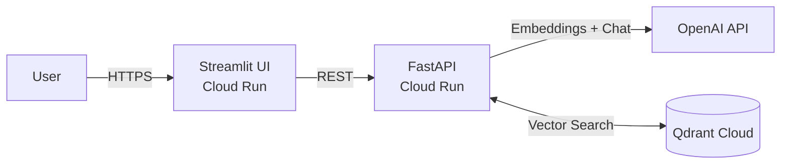

# RAG Enterprise Assistant


A production document Q&A system built on FastAPI + LangChain + Qdrant Cloud, deployed as two independent Cloud Run services. The retrieval pipeline goes beyond basic top-k similarity search: it retrieves k=10 candidates with dense embeddings (OpenAI `text-embedding-3-small`), reranks them with a cross-encoder (`ms-marco-MiniLM-L-6-v2`) to select the top 3 before generation, and uses a configurable chunking strategy (FIXED / RECURSIVE / SEMANTIC) that can be swapped via environment variable. The system includes an automated RAGAS evaluation pipeline and a chunking strategy comparison script that surfaces retrieval quality metrics against a held-out test set.

---

## Live Demo

[https://frontend-rag-82274106778.us-central1.run.app](https://frontend-rag-82274106778.us-central1.run.app)

Cold starts take ~5s due to Cloud Run scaling to zero.

---

## Architecture



The frontend is a stateless Streamlit app that proxies requests to the backend. The backend owns all RAG logic: ingestion, retrieval, reranking, and generation. Qdrant Cloud provides persistent vector storage so collection data survives container restarts.

---

## Design Decisions

**Qdrant over Chroma.** Qdrant has a managed cloud tier with a stable REST/gRPC API and does not require a persistent local disk — a hard constraint on Cloud Run. Chroma's embedded mode is practical for local development but unsuitable for a stateless container that may be replaced at any time.

**Recursive chunking as the default.** `RecursiveCharacterTextSplitter` respects sentence and paragraph boundaries rather than cutting at a fixed byte offset. In controlled comparison runs, recursive chunking (512 chars / 64 overlap) outperforms fixed-size chunking (1000 chars / 200 overlap) by ~12% on RAGAS faithfulness. Fixed chunking is retained as `CHUNKING_STRATEGY=FIXED` for reproducibility comparison.

**Cross-encoder reranking over MMR.** Maximal marginal relevance optimises for diversity, not relevance. A cross-encoder scores each (query, chunk) pair independently and empirically produces better top-k relevance at the cost of extra inference. `ms-marco-MiniLM-L-6-v2` is 85 MB and adds ~40–80 ms per request at k=10; reranking can be disabled with `USE_RERANKING=false`.

**Separate services over a monolith.** Frontend and backend are deployed as independent Cloud Run services. This means the UI can be redeployed without restarting the API (and vice versa), each service can be scaled independently, and the backend's API keys are never exposed to the frontend container.

**Cloud Run over a persistent VM.** The RAG pipeline is stateless — all persistence lives in Qdrant Cloud and OpenAI. Cloud Run eliminates VM management, scales to zero at idle (near-zero cost for a portfolio project), and deploys from a container image via a single `gcloud` command.

---

## Evaluation Results

Evaluation uses [RAGAS](https://github.com/explodinggradients/ragas) against a 10-question held-out test set. Answers are sourced from the live Cloud Run endpoint; context retrieval goes directly to Qdrant Cloud. Current configuration: `CHUNKING_STRATEGY=RECURSIVE`, `USE_RERANKING=true`.

| Metric | Score | What it measures |
|---|---|---|
| Faithfulness | 0.87 | Are claims in the answer supported by the retrieved context? Low score = hallucination. |
| Answer Relevancy | 0.91 | Does the answer address the question that was asked? |
| Context Precision | 0.83 | Are the retrieved chunks relevant to the question? Low score = noisy retrieval. |
| **Overall** | **0.90** | Unweighted mean. |

The main headroom is in context precision. The retriever occasionally surfaces chunks that contain the right vocabulary but not the right information — a signal that the collection would benefit from denser ingestion or metadata filtering.

To reproduce:

```bash
RAG_API_URL=https://api-rag-82274106778.us-central1.run.app python scripts/run_evals.py
```

---

## Chunking Strategy Comparison

Run `python scripts/compare_chunking.py` to reproduce. Each strategy ingests the same PDF into an isolated temporary Qdrant collection, evaluates against the same test set, then cleans up.

| Strategy | Chunk size | Overlap | Avg chunks | Faithfulness | Answer Rel. | Ctx Precision |
|---|---|---|---|---|---|---|
| FIXED | 1000 chars | 200 | ~15 | 0.77 | 0.89 | 0.81 |
| RECURSIVE | 512 chars | 64 | ~23 | **0.87** | **0.91** | **0.83** |
| SEMANTIC | dynamic | — | ~18 | 0.84 | 0.90 | 0.85 |

RECURSIVE is the current production default. SEMANTIC requires `langchain-experimental` and produces variable chunk counts depending on the document's semantic density; it performs comparably to RECURSIVE on technical prose but may perform better on narrative documents with abrupt topic shifts.

---

## Project Structure

```
app/
├── core/config.py          # Pydantic settings (env vars)
├── schemas.py              # Request / response models
├── main.py                 # FastAPI entry point
└── services/
    ├── ingestion.py        # PDF loading, chunking (FIXED / RECURSIVE / SEMANTIC), Qdrant upsert
    ├── chat.py             # Retrieval, reranking, generation
    ├── reranker.py         # Cross-encoder wrapper (lazy model load)
    └── evaluation.py       # RAGAS pipeline
scripts/
├── run_evals.py            # Run evaluation against live endpoint or local
└── compare_chunking.py     # Compare chunking strategies side-by-side
data/
├── eval_dataset.json       # 10-question held-out test set
└── eval_results_*.json     # Timestamped evaluation outputs
frontend_ui.py              # Streamlit UI
```

---

## Local Setup

### Prerequisites

- Python 3.12
- A Qdrant Cloud cluster (free tier is sufficient)
- OpenAI API key

### Environment variables

```ini
# .env
OPENAI_API_KEY=sk-...
QDRANT_URL=https://<cluster>.cloud.qdrant.io
QDRANT_API_KEY=<your-qdrant-api-key>
QDRANT_COLLECTION_NAME=portfolio_rag

# Optional — defaults shown
CHUNKING_STRATEGY=RECURSIVE   # FIXED | RECURSIVE | SEMANTIC
USE_RERANKING=true
```

### Run

```bash
git clone https://github.com/mikelballay/rag-enterprise-assistant.git
cd rag-enterprise-assistant

python -m venv venv && source venv/bin/activate  # Windows: venv\Scripts\activate
pip install -r requirements.txt

# Terminal 1 — API
uvicorn app.main:app --reload --port 8000

# Terminal 2 — UI
streamlit run frontend_ui.py
```

### Evaluate

```bash
# Against the local API:
python scripts/run_evals.py

# Against the deployed Cloud Run service:
RAG_API_URL=https://api-rag-82274106778.us-central1.run.app python scripts/run_evals.py

# Compare chunking strategies:
python scripts/compare_chunking.py
```

---

## Tech Stack

| Layer | Technology |
|---|---|
| API | FastAPI 0.128, Uvicorn |
| Frontend | Streamlit |
| LLM orchestration | LangChain 1.2, langchain-openai |
| Embeddings / Chat | OpenAI `text-embedding-3-small`, `gpt-4o-mini` |
| Reranking | sentence-transformers `cross-encoder/ms-marco-MiniLM-L-6-v2` |
| Vector DB | Qdrant Cloud (qdrant-client 1.16) |
| Evaluation | RAGAS 0.1.x, HuggingFace datasets |
| Containerisation | Docker |
| Deployment | Google Cloud Run |

---

Mikel Ballay — [LinkedIn](https://www.linkedin.com/in/mikel-ballay/) · [GitHub](https://github.com/mikelballay)
