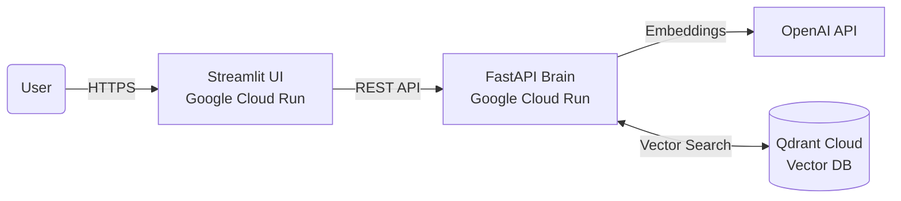

# 🧠 RAG Enterprise Assistant | Cloud Native


> **Document Intelligence Assistant** deployed in a Serverless Microservices architecture. Capable of analyzing PDF documents, generating vector embeddings, and answering precise questions based on the extracted context.

---

## 🚀 Live Demo

Try the application deployed on Google Cloud Platform:
### 👉 [Access the Assistant (Click Here)](https://frontend-rag-82274106778.us-central1.run.app/)

*(Note: As a serverless service, it may take a few seconds to "wake up" on first use).* 

---

## 🏗️ System Architecture

The project follows a modern **decoupled microservices** architecture, ensuring scalability and maintainability.



**Components:**
- **Frontend (UI):** Interface built with Streamlit. Manages file uploads and interactive chat. Containerized with Docker.
- **Backend (API):** Logical brain using FastAPI. Orchestrates document ingestion (RAG pipeline) and response generation.
- **Vector Database:** Qdrant (Cloud) for persistent vector storage and high-speed semantic search.
- **LLM:** Integration with OpenAI (GPT) via LangChain for final reasoning.

⚡ **Key Features**
- Document Ingestion: PDF processing, chunking, and automatic vectorization.
- Semantic Search: Retrieves by meaning rather than exact keywords using embeddings.
- Serverless Architecture: Deployed on Google Cloud Run, scales to zero when idle (cost‑efficient).
- Containerization: Reproducible environments thanks to Docker.
- Persistence: Knowledge stored in Qdrant, not lost on server restart.

🛠️ **Tech Stack**
- Language: Python 3.12
- Frameworks: FastAPI, Streamlit
- AI & NLP: LangChain, OpenAI API
- Database: Qdrant Client
- DevOps: Docker, Google Cloud Platform (GCP), Git

📂 **Project Structure**
```
Plaintext
├── Dockerfile.api        # Backend image configuration
├── Dockerfile.frontend   # Frontend image configuration
├── main.py               # API entry point (FastAPI)
├── frontend_ui.py        # User interface (Streamlit)
├── rag_logic.py          # RAG logic (LangChain + Qdrant)
├── requirements.txt      # Project dependencies
└── README.md             # Documentation
```

💻 **Local Execution**
To run this project locally:

1. **Clone the repository:**
   ```bash
   git clone https://github.com/mikelballay/rag-enterprise-assistant.git
   cd rag-enterprise-assistant
   ```

2. **Configure Environment Variables:**
   Create a `.env` file and add your keys:
   ```ini
   OPENAI_API_KEY=your-openai-key
   QDRANT_URL=your-qdrant-url
   QDRANT_API_KEY=your-qdrant-key
   ```

3. **Install dependencies:**
   ```bash
   pip install -r requirements.txt
   ```

4. **Run Backend and Frontend (in separate terminals):**
   ```bash
   # Terminal 1 (Backend)
   uvicorn main:app --reload

   # Terminal 2 (Frontend)
   streamlit run frontend_ui.py
   ```

**Author**
Developed by Mikel Ballay.

[Linkedin](https://www.linkedin.com/in/mikel-ballay/)


